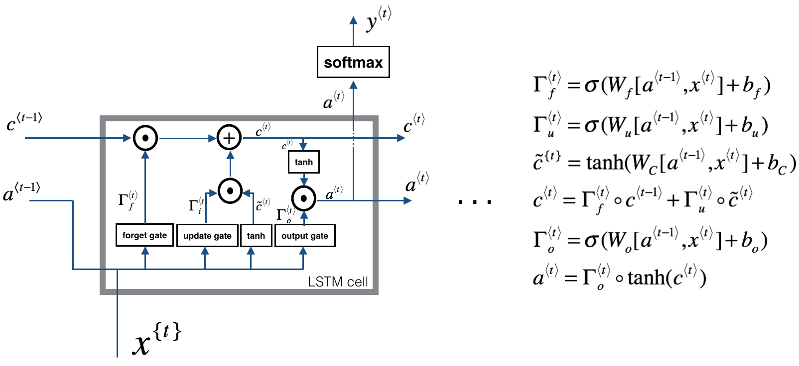
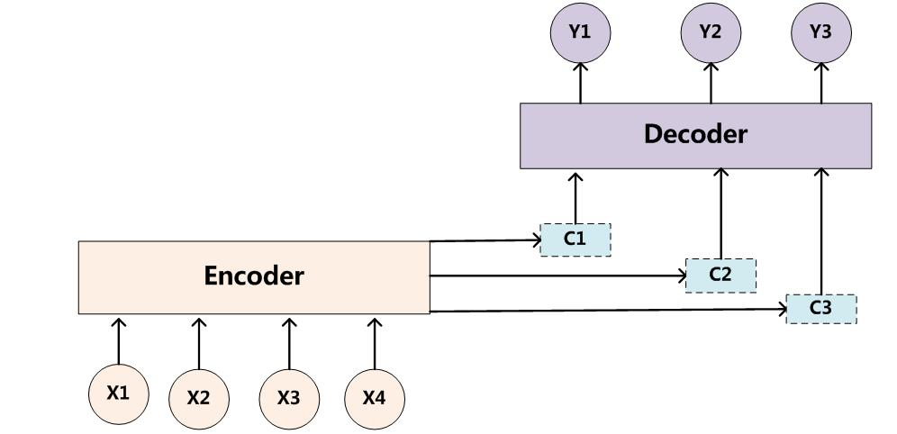

# 名词解试
## 感受野
### 感受野的概念
在卷积神经网络中，感受野（Receptive Field）的定义是卷积神经网络每一层输出的特征图（feature map）上的像素点在输入图片上映射的区域大小。再通俗点的解释是，特征图上的一个点对应输入图上的区域

### 感受野的计算
感受野计算时有下面的几个情况需要说明：

　　（1）第一层卷积层的输出特征图像素的感受野的大小等于滤波器的大小

　　（2）深层卷积层的感受野大小和它之前所有层的滤波器大小和步长有关系

　　（3）计算感受野大小时，忽略了图像边缘的影响，即不考虑padding的大小，关于这个疑惑大家可以阅读一下参考文章2的解答进行理解

这里的每一个卷积层还有一个strides的概念，这个strides是之前所有层stride的乘积。  

　　即strides（i） = stride(1) * stride(2) * ...* stride(i-1) 

　　关于感受野大小的计算采用top to down的方式， 即先计算最深层在前一层上的感受野，然后逐渐传递到第一层，使用的公式可以表示如下：　　　

　　     RF = 1 #待计算的feature map上的感受野大小
　　for layer in （top layer To down layer）:
　　　　RF = ((RF -1)* stride) + fsize

stride 表示卷积的步长； fsize表示卷积层滤波器的大小　　

## 均值滤波与高斯滤波
过滤是信号和图像处理中基本的任务。其目的是根据应用环境的不同，选择性的提取图像中某些认为是重要的信息。过滤可以移除图像中的噪音、提取感兴趣的可视特征、允许图像重采样等等。频域分析将图像分成从低频到高频的不同部分。低频对应图像强度变化小的区域，而高频是图像强度变化非常大的区域。在频率分析领域的框架中，滤波器是一个用来增强图像中某个波段或频率并阻塞（或降低）其他频率波段的操作。低通滤波器是消除图像中高频部分，但保留低频部分。高通滤波器消除低频部分.

### 均值滤波

均值滤波是一种线性滤波器，处理思路也很简单，就是将一个窗口区域中的像素计算平均值，然后将窗口中计算得到的均值设置为锚点上的像素值。

该算法有优点在于效率高，思路简单。同样，缺点也很明显，计算均值会将图像中的边缘信息以及特征信息“模糊”掉，会丢失很多特征。

均值滤波使用简单的卷积方案来实现，既然是计算窗口区域中的像素和，即使用如下卷积核即可。图像的边界部分采用padding操作处理。另外，得到的锚点像素值要进行归一化，即除以窗口尺寸大小。在OpenCV中，我们使用cv.blur（）这个函数即可实现。

### 中值滤波
中值滤波是一种非线性滤波，在处理脉冲噪声以及椒盐噪声时效果极佳，能够有效的保护好图像的边缘信息。

中值滤波的处理思路很简单，取卷积核当中所覆盖像素中的中值作为锚点的像素值即可。

如果按照遍历所有像素，再对卷积核中的像素排序取中值，那么时间复杂度会很高，需要对中值滤波进行改进。

中值滤波的改进实际上很是很好想的，无非就是一个滑动窗口取中值的问题，每次向右滑动的过程中等于在窗口中新添加添加一列窗口像素，同时减去一列窗口像素，考虑维护这个窗口中的像素信息变化即可。

在OpenCV中，我们使用cv.medianBlur（）这个函数即可实现。

## SIFT
SIFT算法是一种计算机视觉算法，用来检测和描述图像局部特征，在间尺度中寻找极值点，并提取出其位置、尺度、旋转不变量，此算法由David Lowe在1999年所发表，2004年完善总结（Distinctive Image Features from Scale-Invariant Keypoints，Lowe D G 2004）。后续的论文中也有许多基于SIFT改进的论文，例如SURF将SIFT的许多过程近似，达到加速的效果；PCA-SIFT利用主成分分析降低描述子的维度，减少内存的使用并加快配对速度。

SIFT算法具有如下特点：

●不变性：SIFT描述图像的局部特征，对图像的旋转和尺度变化具有不变性，对三维视角变化和光照变化具有很强的适应性，在遮挡和场景杂乱时仍保持不变性；

●辨别能力强：特征之间相互区分的能力强，能够在海量的特征中进行快速、准确地匹配；

●特征点数量较多：即使是一幅较小的图片也能够产生足够多的特征点，如一幅500×500的图像能提取出约2000个特征点；

●可扩展性强：可以很方便的与其他形式的特征向量进行联合。
## 机器视觉特征提取介绍：HOG、SIFT、SURF、ORB、LBP、HAAR
https://blog.csdn.net/yuanlulu/article/details/82148429?utm_medium=distribute.pc_relevant.none-task-blog-BlogCommendFromMachineLearnPai2-2.nonecase&depth_1-utm_source=distribute.pc_relevant.none-task-blog-BlogCommendFromMachineLearnPai2-2.nonecase
（在根目录下有SIFT、SURF、ORB.doc文档详细介绍三者）
# 问答题
## 深度学习为什么在计算机视觉领域这么好？
以目标检测为例，传统的计算机视觉方法需首先基于经验手动设计特征，然后使用分类器分类，这两个过程都是分开的。而深度学习里的卷积网络可实现对局部区域信息的提取，获得更高级的特征，当神经网络层数越多时，提取的特征会更抽象，将更有助于分类，同时神经网路将提取特征和分类融合在一个结构中。
## 机器学习和深度学习的区别
机器学习在训练模型之前，需要手动设置特征，即需要做特征工程；
深度学习可自动提取特征；
所以深度学习自动提取的特征比机器学习手动设置的特征鲁棒性更好。
## 神经网络的优缺点？
优点:

1.拟合复杂的函数：随着神经网络层数的加深，网络的非线性程度越来越高，从而可拟合更加复杂的函数；

2.结构灵活：神经网络的结构可根据具体的任务进行相应的调整，选择适合的网络结构；

3.神经网络可自动提取特征，比人工设置的特征鲁棒性更好；

缺点：

1.由于神经网络强大的假设空间，使得神经网络极易陷入局部最优，使得模型的泛化能力较差；

2.当网络层数深时，神经网络在训练过程中容易产生梯度消失和梯度下降的问题；

3.随着网络层数的加深，神经网络收敛速度越来越慢；

4.神经网络训练参数多，占用内存大；

## 什么样的资料不适合用深度学习？

数据集太小，因为神经网络有效的关键就是大量的数据，有大量的参数需要训练，少量的数据不能充分训练参数。
数据集没有局部相关性。目前深度学习应用的领域主要是图像、语音、自然语言处理，这些领域的共性就是局部相关性。例如：图像中的像素组成物体，语音中的音位组成单词，文本数据中的单词组成句子，而深度学习的本质就是学习局部低层次的特征，然后组合低层次的特征成高层次的特征，得到不同特征之间的空间相关性。
## 为何神经网络权重初始化要随机初始化，不能以0为初始化？
因为如果W初始化为0 则对于任何Xi，每个隐藏层对应的每个神经元的输出都是相同的，这样即使梯度下降训练，无论训练多少次，这些神经元都是对称的，无论隐藏层内有多少个结点，都相当于在训练同一个函数。

## CNN的优缺点
### 优点
共享卷积核，处理高维数据无压力；
可以自动进行特征提取
卷积层可以提取特征， 卷积层中的卷积核（滤波器）真正发挥作用，通过卷积提取需要的特征
### 缺点
当网络层次太深时，采用BP传播修改参数会使靠近输入层的参数改动较慢；
采用梯度下降算法很容易使训练结果收敛于局部最小值而非全局最小值；
池化层会丢失大量有价值信息，忽略局部与整体之间关联性；
由于特征提取的封装，为网络性能的改进罩了一层黑盒
### 改进
数据增广($\color{red}{待补充}$)

## 1*1的卷积层作用是什么？
1x1 卷积可以压缩信道数。池化可以压缩宽和高，减少模型参数(googlenet的inception模块)
1x1 卷积给神经网络增加非线性，从而减少或保持信道数不变，也可以增加信道数
对于单通道feature map 用单核卷积即为乘以一个参数，而一般情况都是多核卷积多通道，实现多个feature map的线性组合

## 各种激活函数的作用
激活函数是用来加入非线性因素的，提高神经网络对模型的表达能力，解决线性模型所不能解决的问题。

Sigmoid激活函数 优点：

将函数值的范围压缩到[0,1]，可以压缩数据，且幅度不变。在特征相差比较复杂或是相差不是特别大时效果比较好。
可以看到sigmoid函数处处连续便于求导，便于前向传输。

Sigmoid激活函数 缺点：

不是关于原点对称；
需要计算exp，求导计算量很大，同时也容易出现梯度消失问题

Tanh 激活函数 优点：

关于原点对称
比sigmoid梯度更新更快

ReLU激活函数 优点：

神经元输出为正时，没有饱和区
计算复杂度低，效率高
在实际应用中，比sigmoid、tanh更新更快
相比于sigmoid更加符合生物特性
ReLU激活函数 缺点：

神经元输出为负时，进入了饱和区
神经元的输出在非0中心
使得数据存在Active ReLU、Dead ReLU(当wx+b<0时，将永远无法进行权值更新，此时的神经元将死掉)的问题
Leaky ReLU激活函数 优点：

解决了ReLU激活函数Dead ReLU问题；

## LSTM
LSTM(Long Short-Term Memory)是长短期记忆网络，是一种时间递归神经网络，适合于处理和预测时间序列中间隔和延迟相对较长的重要事件。LSTM 已经在科技领域有了多种应用。基于 LSTM 的系统可以学习翻译语言、控制机器人、图像分析、文档摘要、语音识别图像识别、手写识别、控制聊天机器人、预测疾病、点击率和股票、合成音乐等等任务。
### LSTM原理
LSTM区别于RNN的地方，主要就在于它在算法中加入了一个判断信息有用与否的"处理器"，这个处理器作用的结构被称为cell。
一个cell当中被放置了三扇门，分别叫做输入门、遗忘门和输出门。一个信息进入LSTM的网络当中，可以根据规则来判断是否有用。只有符合算法认证的信息才会留下，不符的信息则通过遗忘门被遗忘。
说起来无非就是一进二出的工作原理，却可以在反复运算下解决神经网络中长期存在的大问题。目前已经证明，LSTM是解决长序依赖问题的有效技术，并且这种技术的普适性非常高，导致带来的可能性变化非常多。各研究者根据LSTM纷纷提出了自己的变量版本，这就让LSTM可以处理千变万化的垂直问题。

LSTM还是有其局限性：时序性的结构一方面使其很难具备高效的并行计算能力（当前状态的计算不仅要依赖当前的输入，还要依赖上一个状态的输出），另一方面使得整个LSTM模型（包括其他的RNN模型，如GRU）总体上更类似于一个马尔可夫决策过程，较难以提取全局信息。
## GRU
关于GRU的结构我这里就不细讲了，在参考文献中有很多相关资料，大家想了解的可以去看看，简单来说，GRU可以看作一个LSTM的简化版本，其将$ a^t $与$ c^t $两个变量整合在一起，且讲遗忘门和输入门整合为更新门，输出门变更为重制门，大体思路没有太大变化。两者之间的性能往往差别不大，但GRU相对来说参数量更少。收敛速度更快。对于较少的数据集我建议使用GRU就已经足够了，对于较大的数据集，可以试试有较多参数量的LSTM有没有令人意外的效果。
## RNN
## Resnet
它差不多是当前应用最为广泛的CNN特征提取网络.
VGG网络试着探寻了一下深度学习网络的深度究竟可以深几许以能持续地提高分类准确率。我们的一般印象当中，深度学习愈是深（复杂，参数多）愈是有着更强的表达能力。凭着这一基本准则CNN分类网络自Alexnet的7层发展到了VGG的16乃至19层，后来更有了Googlenet的22层。可后来我们发现深度CNN网络达到一定深度后再一味地增加层数并不能带来进一步地分类性能提高，反而会招致网络收敛变得更慢，test dataset的分类准确率也变得更差。排除数据集过小带来的模型过拟合等问题后，我们发现过深的网络仍然还会使分类准确度下降（相对于较浅些的网络而言）。
正是受制于此不清不楚的问题，VGG网络达到19层后再增加层数就开始导致分类性能的下降。而Resnet网络作者则想到了常规计算机视觉领域常用的residual representation的概念，并进一步将它应用在了CNN模型的构建当中，于是就有了基本的residual learning的block。它通过使用多个有参层来学习输入输出之间的残差表示，而非像一般CNN网络（如Alexnet/VGG等）那样使用有参层来直接尝试学习输入、输出之间的映射。实验表明使用一般意义上的有参层来直接学习残差比直接学习输入、输出间映射要容易得多（收敛速度更快），也有效得多（可通过使用更多的层来达到更高的分类精度）。

### 有参网络层
有参数可以学习的层，例如，卷积层、全连接层都是有参的，但是池化层是无参的
## Transformer
Transformer由论文《Attention is All You Need》提出，现在是谷歌云TPU推荐的参考模型。Attention机制在NLP领域的应用最早可以追朔到2014年，Bengio团队将Attention引入NMT(神经机器翻译)任务。之后更是在深度学习的各个领域得到了广泛应用：如CV中用于捕捉图像上的感受野；NLP中定位关键token/feature.
作为某种程度上可以称为当下NLP领域最强的特征抽取器的transformer，同样不是一蹴而就的：
1.Transformer 首个完全抛弃RNN的recurrence，CNN的convolution，仅用attention来做特征抽取的模型
2.Universal Transformer 重新将recurrence引入transformer，并加入自适应的思想，使得transformer图灵完备，并有着更好的泛化性和计算效率
3.Transformer-XL 在transformer的基础上加入Segment-level Recurrence和相对位置编码，从而可以处理超长输入序列，并且更加高效。
在文章开始，首先尝试提出几个问题，来帮助我们理解transformer这一系列模型的思想：
1. 为什么要引入attention机制？
Attention机制理论上可以建模任意长度的长距离依赖，并且符合人类直觉
2. transformer有哪些优点和不足？
完全基于attention，在可以并行的情况下仍然有很强的特征抽取能力，缺点是仍然是自回归的形式、理论上非图灵完备、缺少Recurrent Inductive Bias和条件计算、对超长序列建模能力较差
3. universal transformer相较于transformer做了哪些改进，有什么不足？
利用Recurrence将transformer的层数由6改为了任意层，并且理论上实现了图灵完备（指的是计算上通用）；加入自适应计算的思想，使得模型计算更加高效。
4. transformer-XL的特点，优势是什么？
引入Segment-level Recurrence，使得transformer可以解决“上下文碎片问题”并捕捉更长距离的依赖，从而可以处理超输入序列
transformer仍然是基于seq2seq，所以介绍attention机制之前，需要先介绍下“前attention”时代，NLP领域中的seq2seq。
seq2seq简单的说，就是根据一个输入序列x，来生成另一个输出序列y。seq2seq有很多的应用，例如翻译，文档摘取，问答系统等等。在翻译中，输入序列是待翻译的文本，输出序列是翻译后的文本；在问答系统中，输入序列是提出的问题，而输出序列是答案。
为了解决seq2seq问题，有人提出了encoder-decoder模型，也就是编码-解码模型。所谓编码，就是将输入序列转化成一个固定长度的向量；解码，就是将之前生成的固定向量再转化成输出序列。
## 自编码器Encoder-Decoder
现阶段的深度学习模型，我们通常都将其看作黑箱，而Encoder-Decoder框架则是将这个黑箱分为两个部分，一部分做编码，另一部分做解码。

在不同的NLP任务中，Encoder框架及Decoder框架均是由多个单独的特征提取器堆叠而成，比如说我们之前提到的LSTM结构或CNN结构。由最初的one-hot向量通过Encoder框架，我们将得到一个矩阵（或是一个向量），这就可以看作其对输入序列的一个编码。而对于Decoder结构就比较灵活饿了，我们可以根据任务的不同，对我们得到的“特征”矩阵或“特征”向量进行解码，输出为我们任务需要的输出结果。因此，对于不同的任务，如果我们堆叠的特征抽取器能够提取到更好的特征，那么理论上来说，在所有的NLP任务中我们都能够得到更好的表现。
最大的局限性就在于编码和解码之间的唯一联系就是一个固定长度的语义向量C。也就是说，编码器要将整个序列的信息压缩进一个固定长度的向量中去。但是这样做有两个弊端，一是语义向量无法完全表示整个序列的信息，还有就是先输入的内容携带的信息会被后输入的信息稀释掉，或者说，被覆盖了。输入序列越长，这个现象就越严重。这就使得在解码的时候一开始就没有获得输入序列足够的信息， 那么解码的准确度自然也就要打个折扣了.
为了解决这个问题，作者提出了Attention模型，或者说注意力模型。简单的说，这种模型在产生输出的时候，还会产生一个“注意力范围”表示接下来输出的时候要重点关注输入序列中的哪些部分，然后根据关注的区域来产生下一个输出，如此往复。模型的大概示意图如下所示 

相比于之前的encoder-decoder模型，attention模型最大的区别就在于它不在要求编码器将所有输入信息都编码进一个固定长度的向量之中。相反，此时编码器需要将输入编码成一个向量的序列，而在解码的时候，每一步都会选择性的从向量序列中挑选一个子集进行进一步处理。这样，在产生每一个输出的时候，都能够做到充分利用输入序列携带的信息。而且这种方法在翻译任务中取得了非常不错的成果。
##  有哪些数据增强的方法
空间几何变换：裁剪，翻转，旋转，缩放，仿射变换，视觉变换（四点透视变换）
像素颜色变换：噪声，模糊，HSV对比度变换，RGB颜色扰动，随机擦除，超像素法，转换，边界检测，锐化与浮雕
多样本合成类：
SMOTE（Synthetic Minority Over-sampling Technique），通过人工合成新样本来处理样本不平衡问题，提升分类器性能。
SamplePairing方法，从训练集中随机抽取两张图片分别经过基础数据增强操作（如随机翻转等）处理后经像素取平均值的形式叠加合成一个新的样本，标签为原样本标签中的一种。
mixup是基于邻域风险最小化（VRM）原则的数据增强方法，使用线性插值得到新样本数据。
mixup

总结：mixup、SMOTE、SamplePairing三者思路上有相同之处，都是试图将离散样本点连续化来拟合真实样本分布，但所增加的样本点在特征空间中仍位于已知小样本点所围成的区域内。
##  如何解决样本不平衡问题
数据层面：数据重采样和产生新数据型(SMOTE)。
模型层面：
代价敏感学习，为少数类样本赋予更大的权值
组合集成方法，将多数类数据随机分成少数类数据的量N份，每一份与全部的少数类数据一起训练成为一个分类器，最后再组合。
评价指标：F值，G-Mean，ROC曲线和AUC
## 梯度消失，爆炸的原因
### 深层网络角度
从深层网络角度来讲，不同的层学习的速度差异很大，表现为网络中靠近输出的层学习的情况很好，靠近输入的层学习的很慢，有时甚至训练了很久，前几层的权值和刚开始随机初始化的值差不多。因此，梯度消失、爆炸，其根本原因在于反向传播训练法则，属于先天不足，另外多说一句，Hinton提出capsule的原因就是为了彻底抛弃反向传播。
### 激活函数角度
计算权值更新信息的时候需要计算前层偏导信息，因此如果激活函数选择不合适，比如使用sigmoid，梯度消失就会很明显了，原因看下图，左图是sigmoid的损失函数图，右边是其导数的图像，如果使用sigmoid作为损失函数，其梯度是不可能超过0.25的，这样经过链式求导之后，很容易发生梯度消失

同理，tanh作为激活函数，它的导数图如下，可以看出，tanh比sigmoid要好一些，但是它的导数仍然是小于1的

## 什么方式可以解决梯度消失问题
### 方案1-预训练加微调
此方法来自Hinton在2006年发表的一篇论文，Hinton为了解决梯度的问题，提出采取无监督逐层训练方法，其基本思想是每次训练一层隐节点，训练时将上一层隐节点的输出作为输入，而本层隐节点的输出作为下一层隐节点的输入，此过程就是逐层“预训练”（pre-training）；在预训练完成后，再对整个网络进行“微调”（fine-tunning）。Hinton在训练深度信念网络（Deep Belief Networks中，使用了这个方法，在各层预训练完成后，再利用BP算法对整个网络进行训练。此思想相当于是先寻找局部最优，然后整合起来寻找全局最优，此方法有一定的好处，但是目前应用的不是很多了。
### 方案2-梯度剪切、正则
梯度剪切这个方案主要是针对梯度爆炸提出的，其思想是设置一个梯度剪切阈值，然后更新梯度的时候，如果梯度超过这个阈值，那么就将其强制限制在这个范围之内。这可以防止梯度爆炸。
另外一种解决梯度爆炸的手段是采用权重正则化（weithts regularization）比较常见的是$l1$正则，和$l2$正则，在各个深度框架中都有相应的API可以使用正则化，比如在tensorflowtensorflowtensorflow中，若搭建网络的时候已经设置了正则化参数，则调用以下代码可以直接计算出正则损失：
### 方案3-relu、leakrelu、elu等激活函数
Relu思想也很简单，如果激活函数的导数为1，那么就不存在梯度消失爆炸的问题了，每层的网络都可以得到相同的更新速度，relu就这样应运而生。

relu的主要贡献在于：
 -- 解决了梯度消失、爆炸的问题
 -- 计算方便，计算速度快
 -- 加速了网络的训练
同时也存在一些缺点：
-- 由于负数部分恒为0，会导致一些神经元无法激活（可通过设置小学习率部分解决）
 -- 输出不是以0为中心的
leakrelu就是为了解决relu的0区间带来的影响，其数学表达为：$leakrelu=max(k∗x,x)$其中k是leak系数，一般选择0.01或者0.02，或者通过学习而来,leakrelu解决了0区间带来的影响，而且包含了relu的所有优点
### 解决方案4-batchnorm
Batchnorm是深度学习发展以来提出的最重要的成果之一了，目前已经被广泛的应用到了各大网络中，具有加速网络收敛速度，提升训练稳定性的效果，Batchnorm本质上是解决反向传播过程中的梯度问题。batchnorm全名是batch normalization，简称BN，即批规范化，通过规范化操作将输出信号x规范化保证网络的稳定性。
具体的batchnorm原理非常复杂，在这里不做详细展开，此部分大概讲一下batchnorm解决梯度的问题上。具体来说就是反向传播中，经过每一层的梯度会乘以该层的权重，举个简单例子：
正向传播中$f_2=f_1(w^T*x+b)$那么反向传播中，$\frac {\partial f_2}{\partial w}=\frac{\partial f_2}{\partial f_1}x$，反向传播式子中有$x$的存在，所以$x$的大小影响了梯度的消失和爆炸，batchnorm就是通过对每一层的输出规范为均值和方差一致的方法，消除了$x$带来的放大缩小的影响，进而解决梯度消失和爆炸的问题，或者可以理解为BN将输出从饱和区拉倒了非饱和区。
### 解决方案5-残差结构
残差网络的出现导致了image net比赛的终结，自从残差提出后，几乎所有的深度网络都离不开残差的身影，相比较之前的几层，几十层的深度网络，在残差网络面前都不值一提，残差可以很轻松的构建几百层，一千多层的网络而不用担心梯度消失过快的问题，原因就在于残差的捷径（shortcut）部分，其中残差单元如下图所示：

### 解决方案6-LSTM
LSTM全称是长短期记忆网络（long-short term memory networks），是不那么容易发生梯度消失的，主要原因在于LSTM内部复杂的“门”(gates)DSA，如下图，LSTM通过它内部的“门”可以接下来更新的时候“记住”前几次训练的”残留记忆“，因此，经常用于生成文本中。目前也有基于CNN的LSTM

## BN
https://www.cnblogs.com/guoyaohua/p/8724433.html

# DropOut
在传统神经网络中DropOut层的主要作用是防止权值过度拟合，增强学习能力。DropOut层的原理是，输入经过DropOut层之后，随机使部分神经元不工作（权值为0），即只激活部分神经元，结果是这次迭代的向前和向后传播只有部分权值得到学习，即改变权值。 

因此，DropOut层服从二项分布，结果不是0，就是1，在CNN中可以设定其为0或1的概率来到达每次只让百分之几的神经元参与训练或者测试。

## Segnet原理
 SegNet和FCN思路十分相似，只是Encoder,Decoder(Upsampling)使用的技术不一致。此外SegNet的编码器部分使用的是VGG16的前13层卷积网络，每个编码器层都对应一个解码器层，最终解码器的输出被送入soft-max分类器以独立的为每个像素产生类概率

在传统的CNN网络中，ReLU通常在全连接之后，结合偏置bias用于计算权值的输出，但是，在SegNet作者的研究中发现，激活层越多越有利于图像语义分割。
## Bayesian SegNet
可以知道，在SeNet中最后每个像素都会对每一类的概率进行计算，再通过Softmat输出概率最大的一个，然后这个像素点就认为是这一类别，对应的概率就是这一像素属于该类的概率。这种由原因到结果的推导，可以称为先验概率，任何先验概率使用都会出现一个问题，不能知道这一结果的可靠性，即便先验概率非常大，但是对于不同的样本，先验概率无法保证一定正确。正是如此，才需要有从结果寻找原因的贝叶斯概率，即后验概率，它能给出结果的可信程度，即置信度。Bayesian SegNet正是通过后验概率，告诉我们图像语义分割结果的置信度是多少

Bayesian SegNet与SegNet的差别事实上从网络变化的角度看，Bayesian SegNet只是在卷积层中多加了一个DropOut层，在Bayesian SegNet中，SegNet作者把概率设置为0.5，即每次只有一半的神经元在工作。因为每次只训练部分权值，可以很清楚地知道，DropOut层会导致学习速度减慢。最右边的两个图Segmentation与Model Uncertainty，就是像素点语义分割输出与其不确定度（颜色越深代表不确定性越大，即置信度越低）。

## 非极大抑制
非极大值抑制（Non-Maximum Suppression，NMS），顾名思义就是抑制不是极大值的元素，可以理解为局部最大搜索。这个局部代表的是一个邻域，邻域有两个参数可变，一是邻域的维数，二是邻域的大小。这里不讨论通用的NMS算法(参考论文《Efficient Non-Maximum Suppression》对1维和2维数据的NMS实现)，而是用于目标检测中提取分数最高的窗口的。例如在行人检测中，滑动窗口经提取特征，经分类器分类识别后，每个窗口都会得到一个分数。但是滑动窗口会导致很多窗口与其他窗口存在包含或者大部分交叉的情况。这时就需要用到NMS来选取那些邻域里分数最高（是行人的概率最大），并且抑制那些分数低的窗口。
NMS在计算机视觉领域有着非常重要的应用，如视频目标跟踪、数据挖掘、3D重建、目标识别以及纹纹理分析等。如下图人脸检测框重叠例子

我们的目的就是要去除冗余的检测框,保留最好的一个。
有多种方式可以解决这个问题,Triggs et al. 建议使用Mean-Shift 算法,利用bbox的坐标和当前图片尺度的对数来检测bbox的多种模式.但效果可能并不如使用强分类器结合NMS的效果好.
对于Bounding Box的列表B及其对应的置信度S,采用下面的计算方式.选择具有最大score的检测框M,将其从B集合中移除并加入到最终的检测结果D中.通常将B中剩余检测框中与M的IoU大于阈值Nt的框从B中移除.重复这个过程,直到B为空.

### 重叠率(重叠区域面积比例IOU)阈值

常用的阈值是 0.3 ~ 0.5.
其中用到排序,可以按照右下角的坐标排序或者面积排序,也可以是通过SVM等分类器得到的得分或概率,R-CNN中就是按得分进行的排序.

就像上面的图片一样，定位一个车辆，最后算法就找出了一堆的方框，我们需要判别哪些矩形框是没用的。非极大值抑制的方法是：先假设有6个矩形框，根据分类器的类别分类概率做排序，假设从小到大属于车辆的概率 分别为A、B、C、D、E、F。

(1)从最大概率矩形框F开始，分别判断A~E与F的重叠度IOU是否大于某个设定的阈值;

(2)假设B、D与F的重叠度超过阈值，那么就扔掉B、D；并标记第一个矩形框F，是我们保留下来的。

(3)从剩下的矩形框A、C、E中，选择概率最大的E，然后判断E与A、C的重叠度，重叠度大于一定的阈值，那么就扔掉；并标记E是我们保留下来的第二个矩形框。

就这样一直重复，找到所有被保留下来的矩形框。

## SSD和YOLO对比